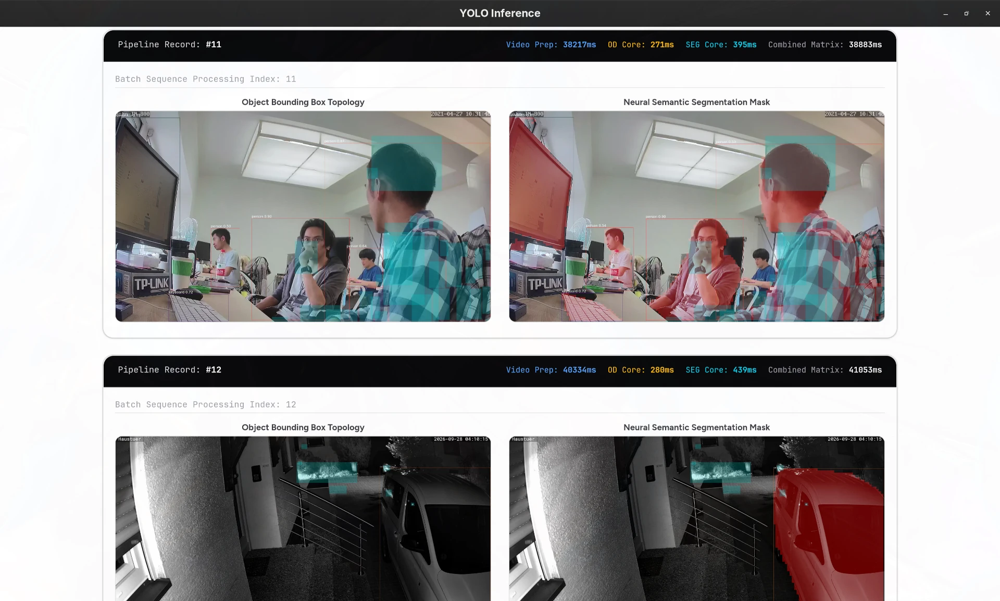
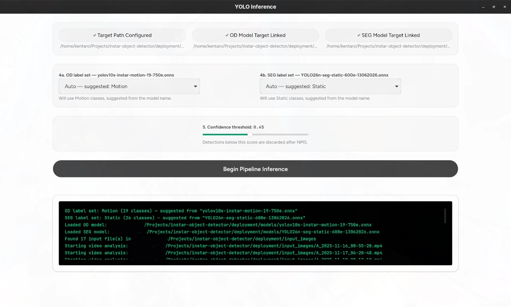

# YOLO Inference — Tauri + Rust + React Desktop App

A cross-platform desktop application that analyzes video and image files for "motion events": it scans a video, locates the moment of significant motion, extracts the most important frame, then runs it through **two ONNX YOLO models in parallel** — an object-detection model (bounding boxes) and an instance-segmentation model (masks) — and renders both results as annotated preview images. Plain image files skip the video stage and go straight into inference.

Built with [Tauri 2](https://tauri.app) as the application shell:

a lightweight Rust core (`src-tauri`) does all the heavy lifting, and a React 19 / TypeScript / Vite frontend (`src`) talks to it over Tauri's typed command/event IPC.



> The UI let's you select both a e.g. YOLOv10 or YOLO26 object detection and segmentation model and batch runs all you input videos through them in paralell. The `teal coloured` are areas where motion was detected. The rest are bounding boxes and segmentation masks for detected objects.

## I. Introduction

`instar-object-detector` is a single-purpose, end-to-end computer vision pipeline packaged as a native desktop app — no web server, no GPU, no Python runtime at run time. What makes it interesting:

- **100% local, CPU-only ONNX inference.** Models run through
  [`tract-onnx`](https://crates.io/crates/tract-onnx) (a pure-Rust ONNX runtime). You download an Ultralytics YOLO export as `.onnx` and that's the only runtime dependency for inference.
- **Statically linked FFmpeg.** Video decoding uses `video-rs` with `ffmpeg-next` built from source and statically linked, so the release binary is self-contained — no system FFmpeg, no dynamic libraries.
- **Motion-event extraction.** Videos are scanned with classic image processing: grayscale conversion, Gaussian blurring, background subtraction, thresholding, morphological dilation and contour detection (`imageproc`) to find *where the action happened* and pick the frame worth analyzing.
- **Two ONNX tensor conventions handled automatically.** The parser understands both *raw / pre-NMS* Ultralytics exports (feature-major, requires in-app NMS) and *end-to-end* NMS-baked-in exports — and both pixel-space and normalized-coordinate variants — so YOLOv10 and YOLO26 exports (and the fine-tuned "instar" variants) all work out of the box.
- **Object detection *and* instance segmentation in one pass.** Bounding boxes come from an OD model; per-instance masks are reconstructed from 32 prototype mask coefficients + learned mask heads, drawn straight onto the frame together with motion-region overlays.
- **Parallel by design.** Files are processed concurrently with `rayon`, and OD + SEG inference for each frame runs on separate threads via `rayon::join` — the two model calls are fully independent.
- **Event-driven UI.** The Rust core streams progress logs and finished result images to the React UI over Tauri events (`log_event`, `image_event`), and previews are loaded through Tauri's `asset:` protocol — no network stack involved.

**Tech stack at a glance:** Tauri 2 · Rust (Rayon, NDArray, Tract-ONNX, FFmpeg-next) · React 19 · TypeScript · Vite 8 · Tailwind CSS 4 · shadcn/ui · Radix UI · `video-rs` · `image` / `imageproc`.

## II. How to Use the Application

### Prerequisites

- **Node.js ≥ 20** and **npm** (install: `nvm install 22`)
- **Rust** — stable toolchain via [rustup](https://rustup.rs) (the provided `build.sh` can also install a private local toolchain for you if `cargo` isn't on your PATH)
- **nasm** — only needed the *first* time FFmpeg is compiled from source (`build.sh` fetches a private copy automatically if it is missing):

  `sudo dnf install nasm` / `sudo apt install nasm` / `brew install nasm`

### 1. Clone and install the JavaScript dependencies

```bash
git clone <this-repo> instar-object-detector
cd instar-object-detector
npm install
```

### 2. Build the Tauri app binary

Easiest — run the one-shot build script:

```bash
./build.sh
```

It executes, in order: `npm install` → `npm run build` (TypeScript + Vite → `dist/`) → ensures Rust and nasm are available → `cargo build --release --features tauri/custom-protocol` inside `src-tauri` (the `custom-protocol` feature matters: without it the release binary tries to load the dev server instead of the bundled frontend) → copies the binary to `deployment/tauri_yolo_release` → syncs all `*.onnx` files from `src-tauri/models/` into `deployment/models/`.

Manual equivalent:

```bash
npm run build
cd src-tauri
cargo build --release --features tauri/custom-protocol
cd ../deployment
# copy the binary in:
install ../src-tauri/target/release/tauri_yolo_release .
```

> First build is slow: FFmpeg is compiled from source and statically linked.
> Rebuilds are incrementally fast.

### 3. Get the YOLO26 models

The app needs two ONNX files at run time — an object-detection model and a segmentation model. The COCO-trained YOLO26 nano models are the defaults:

1. Export them from Ultralytics (or just download the pre-converted `.onnx` weights for `yolo26n` / `yolo26n-seg` from your ultralytics install / training machine):

```bash
pip install ultralytics
yolo export model=yolo26n.pt      format=onnx
yolo export model=yolo26n-seg.pt  format=onnx
```

2. Place the resulting `.onnx` files into **one** of the model directories:

| Location | Used when |
|---|---|
| `src-tauri/models/` | Development — `build.sh` syncs these into deploy |
| `deployment/models/` | Run time — the app reads them from here |

Defaults used by the UI: `models/yolo26n.onnx` (OD) and `models/yolo26n-seg.onnx` (SEG), relative to where the binary is executed (i.e. `deployment/`), so putting them in `deployment/models/` is what matters.

The fine-tuned "instar" models (`YOLO26n-seg-motion…`, `YOLO26n-seg-static…`, `YOLO26s-static…`, `yolov10s-instar-motion…`) ship with the repository — drop any additional custom `.onnx` next to them and pick it in the UI.

### 4. Place your input video(s) or image(s)

Supported inputs are anything in `.avi .mp4 .mkv .mov` (video) plus common image formats. Put files into the **target directory** — the default is:

```
deployment/input_images/
```

(e.g. `cp my_clip.mp4 my_photo.jpg deployment/input_images/`)

Any folder works: the "Choose Images Target" button in the UI lets you point at a different directory — every video/image in it is processed.

### 5. Run the application

```bash
cd deployment
./tauri_yolo_release
```



### 6. Drive the UI

1. **Choose Images Target** — folder containing the videos/images (step 4).
2. **Select OD Model (.onnx)** — object-detection model.
3. **Select SEG Model (.onnx)** — segmentation model.
4. **Label sets** — *per model*: each of OD and SEG has its own selector (`auto` — guessed from that model's filename, or explicitly `COCO`, `Motion` (19 classes), `Static` (26 classes), or a custom label file: `one class per line`, `names: ['a','b']`, or YAML `0: name`). This lets you compare models from different datasets side by side.
5. **Confidence threshold** — default `0.45`; lower to keep more detections.
6. Click **Run Inference** — the log panel streams progress (model loading → motion found → per-model top detections → timings), and below it a result gallery fills up with, per input file:
   - the **OD preview** — frame + motion regions (teal overlay) + bounding boxes with class & confidence,
   - the **SEG preview** — frame + motion regions + segmentation masks,
   - the measured **OD / SEG / video-prep timings**.

Finished images are written to `deployment/predictions/`
(`od_<uuid>.jpg` / `seg_<uuid>.jpg`).


## III. Technical Specifications

### 3.1 Architecture Overview

The app follows a strict UI / native-core split. All image and model work happens in Rust; the React layer only holds UI state and renders events.

```
┌────────────────────────────────────────────────────────────┐
│ React 19 + TS  (src/App.tsx, shadcn/ui, Tailwind 4)        │
│  · path / model / label / threshold state                  │
│  · invoke("run_inference")  ⇄  listen("log_event"/         │
│    "image_event")                                            │
│  · previews via convertFileSrc() → asset: protocol         │
└──────────────────────────┬─────────────────────────────────┘
                           │ Tauri 2 IPC (commands + events)
┌──────────────────────────┴─────────────────────────────────┐
│ Rust core (src-tauri/src/modules/) — spawned via          │
│ tokio::spawn_blocking off the main thread:                │
│  inference.rs   model loading, tensor parsing, NMS, cmd   │
│  video_utils.rs video decode + motion-event extraction    │
│  image_utils.rs  letterbox preprocessing                 │
│  drawing.rs     box / mask / motion-region rendering      │
│  constants.rs   COCO-80 / Motion-19 / Static-26 labels    │
└────────────────────────────────────────────────────────────┘
```

Cross-cutting choices: `rayon` thread pools for parallel file processing and for running the two models simultaneously; tract's NDArray for tensor math; `serde_json` payloads for events; a CSP in `tauri.conf.json` that allows `asset:` for local previews without any server.

### 3.2 File Triage

`run_inference` walks the target directory recursively (`walkdir`, `par_iter` — files are processed concurrently), and splits the work by extension:

- **Video** (`.avi .mp4 .mkv .mov`) → motion-event extraction (§3.3)
- **Image** (everything else) → decode via the `image` crate and preprocess.

### 3.3 Motion-Event Extraction (video path)

`find_motion_pixel(path, start_frame=3, tries=-1, interval=5, threshold=10)` implements a compact, classic image-processing pipeline in `video_utils.rs`:

1. Frames are decoded in order (up to 500 attempts when `tries = -1`) by `video_rs`, which is built against a **statically compiled FFmpeg** (`ffmpeg-next` with the `static` + `build` features) — the binary has zero system dependencies.
2. Each candidate frame is (a) converted to RGB for the inference stage and (b) converted to grayscale (BT.709 luma weights).
3. The grayscale frame is **Gaussian-blurred** (`imageproc::gaussian_blur`) to reject sensor/lighting noise; the first frame is kept as the static background model.
4. **Background subtraction:** `|background − frame| > threshold` → binary mask, then **morphological dilation** (`dilate(LInf, 2)`) bridges fragments.
5. `imageproc::contours::find_contours` extracts object borders; each contour is reduced to a bounding box with a minimum-size filter (`> 10 × 10 px`).
6. The **first frame producing ≥ 1 motion box** is returned together with its boxes — that's the "motion event". If no frame qualifies, the video is skipped with a log message.

### 3.4 Preprocessing (shared by image + video)

`letterbox()` rescales the frame while **preserving aspect ratio**, centers it inside a 640×640 canvas and records `(scale, pad_x, pad_y)`. The frame is then repacked as an RGB→CHW `f32` NDArray tensor of shape `[1, 3, 640, 640]`, normalized to `[0, 1]` (÷255) — the exact input contract of the Ultralytics ONNX exports. Every later un-mapping of a coordinate uses the stored `(scale, pad_x, pad_y)` triple.

### 3.5 Inference Engine

Models are loaded once per run, then executed per file on the
`tokio`-blocking thread pool:

```
tract_onnx::onnx().model_for_path(path)?
            .into_optimized()?   // graph-level IR optimizations
            .into_runnable()
```

`tract-onnx` is a **pure-Rust ONNX runtime** (no C++/CUDA runtime): models run on CPU, which is what makes the app portable across machines without a Python/GPU stack.

**Output parsing — the interesting part.** `parse_od_output` /
`parse_seg_output` normalize three different ONNX tensor conventions into the app's internal `Detection { x1, y1, x2, y2, score, class_id, mask_coefficients }`:

1. **Raw / pre-NMS** (e.g. `yolo26n.onnx` → `[1, 84, 8400]`, seg → `[1, 116, 8400]` + `[1, 32, 160, 160]`): feature-major with 8400 anchors — rows `0..4` are `center-x, center-y, w, h`, next `nc` rows class confidences, (seg:) final 32 rows mask coefficients. The parser picks the argmax class per anchor, thresholds it, converts `cxcywh → xyxy`, and runs an **in-app greedy NMS** (IoU `0.45`, capped at 300 boxes).
2. **End-to-end / NMS-baked-in** (e.g. `[1, 300, 6]`; fine-tuned instar models): one row per detection `[x1, y1, x2, y2, score, class_id]` — no NMS needed.
3. **Coordinate spaces inside e2e outputs differ between model families — but they all refer to the *letterboxed* 640×640 input, never to the original image** (a model that only ever sees the 640 square cannot know the original size): fine-tuned **YOLO26** e2e exports emit xyxy directly *in 640-letterbox pixels*, while the NMS-free **YOLOv10** / static exports emit the *same* letterbox xyxy pre-normalized to `[0, 1]` (÷640). The parser auto-detects which by the tensor magnitude (`max_coord > 1.5` ⇒ pixel space), maps normalized coordinates back with `×640`, and then un-letterboxes both cases with the recorded `(scale, pad)` triple — `(v − pad)/scale` — exactly like the raw branch. This was verified empirically against the letterbox-space COCO reference: on a 3840×2182 frame the fine-tuned pixel e2e model reports a person at `[313.9, 230.3, 399.4, 436.7]` where the COCO raw model reports `[313.7, 231.2, 400.5, 437.7]` (IoU ≈ 0.98 after decoding), and the yolov10s normalized e2e model reports the same car at `≈[0.379, 0.326, 0.877, 0.611]` (×640) where COCO reports `[240, 208, 560, 394]`. A single model run therefore works on any mix of the supported exports without configuration.

Layout discrimination between (1) and (2) is structural: raw exports have few feature rows than anchor columns, e2e outputs have N detection rows and 6/38 columns.

### 3.6 Segmentation Masks

An e2e or raw seg model returns, besides boxes, per-detection **32 mask coefficients** plus a shared set of `[32, 160, 160]` **prototype masks**. `draw_detection_with_mask` reconstructs each instance mask as:

```
mask(x, y) = sigmoid( Σᵢ coeffᵢ · protoᵢ(x, y) )
```

over the 160×160 proto grid, then samples the grid in the *model's input space* for every pixel inside the box region (image → letterbox → ÷4 → proto coord) and shades the pixel where `mask > 0.5`.

### 3.7 Rendering

`drawing.rs` renders straight onto the `image` crate's `RgbImage` canvas (the model's own output, not a GPU): bounding-box strokes + class/score labels in a font embedded in the binary (`include_font!` via `rusttype`), mask fill as a 40% white "lighten" blend, and the video motion regions as a
25%-alpha teal overlay. Each input file produces one OD and one SEG JPEG, written into `./predictions/` and streamed to the React UI as `image_event` events.

### 3.8 Concurrency & Performance

- Files are processed **in parallel across CPU cores** (`entries.par_iter().for_each`).
- Per file, **OD and SEG inference run concurrently** on dedicated rayon threads (`rayon::join` — the two model runs are independent and neither blocks the other).
- The whole batch is spawned with `tokio::task::spawn_blocking` so Rust's blocking image/decode work never starves Tauri's async main thread (the UI keeps responding and streaming logs the whole time).
- The dev profile is also aggressively optimized (`[profile.dev.package."*"] opt-level = 3` in `Cargo.toml`) so `cargo run` behaves like release without waiting for the full build, and all inference dependencies (tract, NDArray) are compiled at `-O3` regardless.
- FFmpeg is **statically linked**, which keeps the release binary portable and free of dynamic-linker headaches on CI-less machines.

### 3.9 Repository Layout (condensed)

```
├── build.sh                     # one-shot build + deployment script
├── deployment/                  # produced / run location after ./build.sh
│   ├── tauri_yolo_release       # the desktop binary
│   ├── models/                  # .onnx files used at runtime
│   │   ├── yolo26n.onnx             # OD (COCO-80)
│   │   ├── yolo26n-seg.onnx         # SEG (COCO-80)
│   │   ├── YOLO26n-seg-motion-…onnx # fine-tuned motion (19 classes)
│   │   ├── YOLO26n-seg-static-…onnx # fine-tuned static (26 classes)
│   │   ├── YOLO26s-static-…onnx     # fine-tuned static (OD variant)
│   │   └── yolov10s-instar-motion-…onnx
│   ├── input_images/            # where you drop your videos/images
│   └── predictions/             # output: od_<uuid>.jpg, seg_<uuid>.jpg
├── src/                         # React frontend
│   ├── App.tsx                  # all UI state + Tauri IPC wiring
│   ├── components/              # shadcn/ui primitives
│   └── main.tsx                 # entry point
└── src-tauri/                   # Rust native core
    ├── models/                  # .onnx source for development builds
    ├── Cargo.toml
    └── src/
        ├── main.rs              # Tauri app entry, video-rs init, plugin registration
        ├── lib.rs               # re-exports modules + tauri command registration
        └── modules/
            ├── inference.rs     # model load, parse, NMS, commands
            ├── video_utils.rs   # video decode + motion-extraction pipeline
            ├── image_utils.rs   # letterbox + RGB→CHW tensorization
            ├── drawing.rs       # box/mask/motion rendering onto canvas
            ├── constants.rs     # COCO/Motion/Static label tables + palettes
            └── models.rs        # Detection, BBox, PreprocessedImage, …
```
